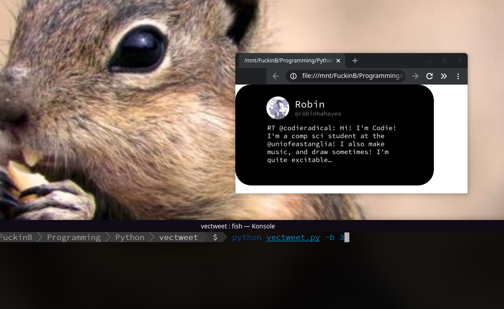

# VecTweet

#### Turn Tweets into .SVGs

**Q:** What does it do?

**A:** Turns tweets into an SVG

**usage:** 

1. Fill out your Twitter API info in the config.json file
2. fill out the username of the default account you would like to convert the last tweet of
3. `python vectweet.py` will output a file called tweet.svg

**options:**

​	-u or --user `python vectweet.py -u codieradical`  - Outputs the last tweet of whatever user you give it

​	-t or --tweet `python vectweet.py -t https://twitter.com/robinhahayes/status/1283515490413969409` - Outputs a specific tweet

​	-b or --back `python vectweet.py -b 5` - Goes back X number of tweets, 1 being latest ( works in combination with -u )

**reqs:**
	Python 3

**modules:**
	svgwrite
	textwrap
	argparse
	python-twitter
	json	

*Made by Robin Universe, licensed under the BSD license*